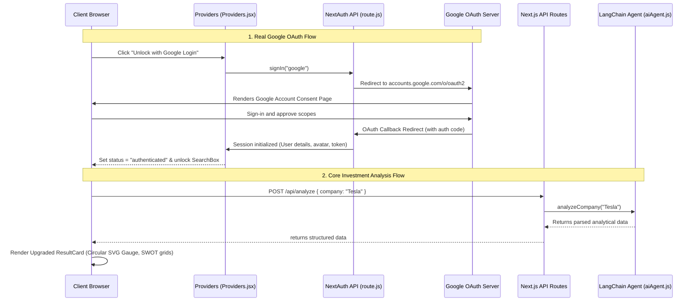

# InvestAgent AI - AI Investment Research Agent

An intelligent, full-stack web application built on **Next.js 14 App Router** and **LangChain.js** that performs automated investment research on any company. Leveraging the **Gemini API** (`gemini-2.5-flash-lite`), the application acts as an expert financial analyst, analyzing company business models, industries, SWOT components, and competitor landscape. The app gates access behind a secure **NextAuth.js Google Login** authentication wall, renders ratings via custom **SVG score meters**, and facilitates interactive **Follow-up Chat Sessions** within a premium, high-fidelity dark-themed AI dashboard.

---

## 🚀 Tech Stack

- **Framework:** Next.js 14 (App Router)
- **Authentication:** NextAuth.js (Auth.js) - Google OAuth Provider
- **Frontend library:** React (using Tailwind CSS for design styling)
- **Icons:** Lucide React (vector symbols for features and chat)
- **AI Orchestration:** LangChain.js (`@langchain/google-genai` and `@langchain/core`)
- **LLM Engine:** Gemini 2.5 Flash Lite (via Google AI Studio)
- **Language:** JavaScript (ES6+)

---

## 📐 System Architecture

The project is structured to separate concern layers clearly, facilitating clean scaling:

```
src/
├── app/
│   ├── layout.js          # Core HTML shell, wraps Providers session context
│   ├── page.js            # Main view router, gates search behind NextAuth session status
│   └── api/
│       ├── auth/
│       │   └── [...nextauth]/
│       │       └── route.js # NextAuth Google provider dynamic API endpoint
│       ├── analyze/
│       │   └── route.js   # API Endpoint for company research (POST /api/analyze)
│       └── chat/
│           └── route.js   # API Endpoint for follow-up chat (POST /api/chat)
├── components/
│   ├── Navbar.jsx         # Header header with dynamic sign-in / profile controls
│   ├── SearchBox.jsx      # Input verification & popular suggestions panel
│   ├── Loading.jsx        # Radar tracker & rotating thinking state simulator
│   ├── ResultCard.jsx     # Upgraded dashboard with SVG Score meters and SWOT grids
│   ├── InvestmentChat.jsx # Interactive chat interface with session history
│   └── Providers.jsx      # NextAuth SessionProvider context shell
├── lib/
│   └── aiAgent.js         # LangChain.js model configurations & prompt pipeline
```

### Data Flow (Auth & Analysis)



---

## 🔑 Google Login Setup (Environment Variables)

To enable real Google Login, you will need to add Google Developer API credentials to your environment variables inside [**.env.local**](file:///c:/AIproject/.env.local):

```env
# Google OAuth Client Credentials
GOOGLE_CLIENT_ID=your_google_client_id.apps.googleusercontent.com
GOOGLE_CLIENT_SECRET=your_google_client_secret

# NextAuth Configuration
NEXTAUTH_SECRET=8fca1605e5da48d5337b8b2e3f4db37a
NEXTAUTH_URL=http://localhost:3000
```

### How to generate Google OAuth credentials:
1. Go to the [Google Cloud Developer Console](https://console.cloud.google.com/).
2. Create a new project or select an existing one.
3. Navigate to **APIs & Services** -> **Credentials**.
4. Click **Configure Consent Screen** (Choose *External*, fill in basic application details, save).
5. Go back to **Credentials**, click **Create Credentials** -> **OAuth client ID**.
6. Select application type: **Web application**.
7. Under **Authorized JavaScript origins**, add:
   - `http://localhost:3000`
8. Under **Authorized redirect URIs**, add:
   - `http://localhost:3000/api/auth/callback/google`
9. Click **Create**. Copy the generated Client ID and Client Secret, and paste them into your [**.env.local**](file:///c:/AIproject/.env.local) file.

---

## 🎨 Premium AI Visual Design

The UI has been overhauled to feel state-of-the-art and "AI-first":

1. **Backdrop Glow System**: Employs absolute-positioned radial blur spheres (using emerald, teal, and purple gradients) that slowly pulse in opacity, creating a futuristic, high-end SaaS feel.
2. **Neon circular SVG Score Gauge**: Rather than displaying text ratings, the score dashboard uses an SVG stroke path that dynamically completes a glowing ring color-coded green, yellow, or red based on the rating:
   - $Score \ge 8$: Emerald glow
   - $Score \ge 5$: Yellow glow
   - $Score < 5$: Rose/Red glow
3. **SWOT Grid Quadrants**: Revamped with specific translucent colors (emerald-950/5 for strengths, rose-950/5 for weaknesses) bounded by thin borders that subtly scale up on mouse hovers (`hover:scale-[1.01]`).

---

## 🛠️ Setup Steps

### 1. Clone & Initialize
Navigate to the project root directory and install dependencies:
```bash
npm install
```

### 2. Configure Environment Variables
Create a `.env.local` file at the root of the project:
```bash
cp .env.example .env.local  # or manually create .env.local
```
Open `.env.local` and add your Gemini API Key and NextAuth variables as detailed above.

### 3. Run Locally (Development)
Launch the development server:
```bash
npm run dev
```
Open your browser and navigate to (https://invest-agent-ai.vercel.app/) to view the interface.

### 4. Build for Production
To generate an optimized production bundle:
```bash
npm run build
npm run start
```
